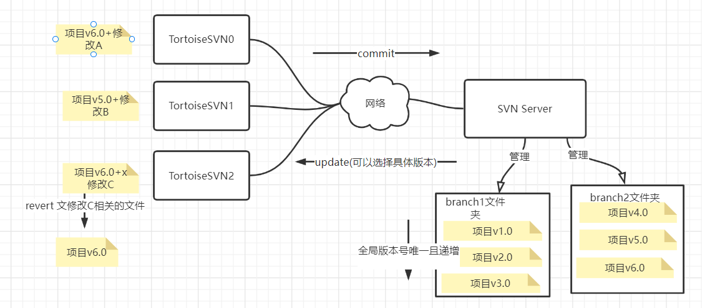
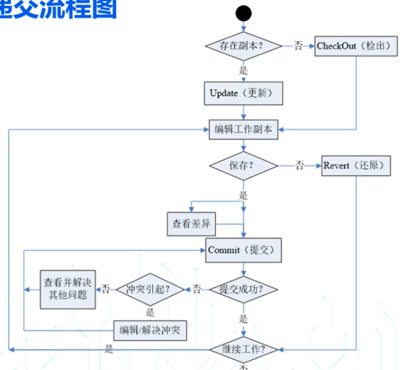
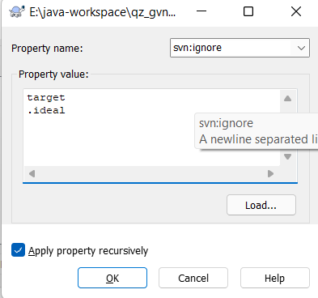
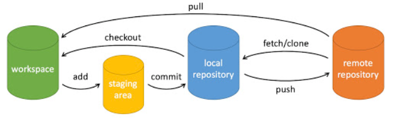
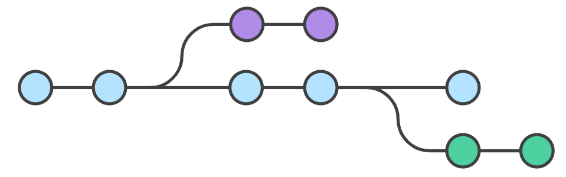
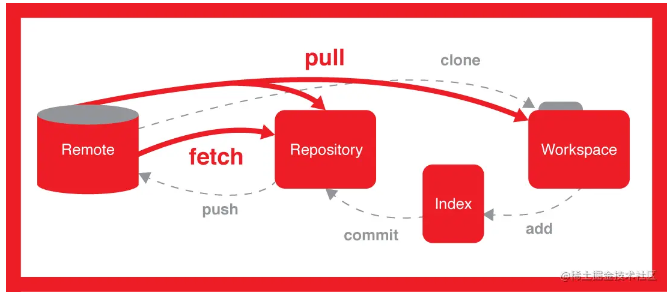
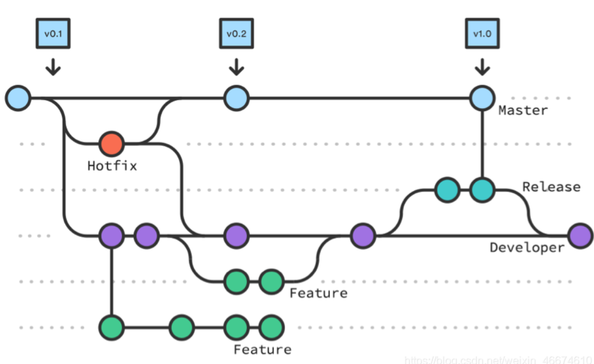

# 1. SVN介绍

## 1.1 基本介绍

* SVN的全称是Subversion, 属于**集中式**版本控制软件, 所谓集中式指的是SVN分为客户端和中心服务器
* SVN客户端(Tortoise SVN)和服务器(VisualSVN Server)通过网络同步项目, **客户端只有一个当前版本**(无历史版本和分支), **服务器会保存所有历史版本**, 并将最新commit的版本作为版本号最高的版本
* 架构图如下



## 1.2 SVN项目版本管理流程图



# 2. SVN CLI基本指令介绍

**checkout** & export

```
通过URL和账号密码将服务器上的项目copy下来, checkout的方式相较于export的方式会额外包含.svn目录
```

**update** & update to revision

```
update: 将服务器上的最新版本同步到本地(可能需要合并冲突)
update to revision: 将服务器上特定的版本同步到本地
```

**commit**

```
将本地副本同步到服务器上作为最新版本
```

**revert**

```
将本地副本上做的修改进行撤销(可以撤销具体文件上进行的修改)
```

通过设置文件夹递归属性svn:ignore(忽略文件夹中的特定名称文件)



# 3. Git介绍

* Git是一个**分布式版本控制软件**, 每一个Git程序同时是一个代码仓库服务器和客户端

Git架构图



# 4. Git基本使用

## 1.1 CLI基本命令介绍

配置签名(仅仅用于远程协作时区分操作者)

```
git config --global user.name Shihan Wang
git config --global user.email anonymous@gmail.com
```

初始化本地仓库

```
git init
```

添加文件到暂存区(文件被git管理)

```
git add 
```

提交暂存区文件到本地仓库作为分支的下一个版本

```
git commit -m "<备注>" <-a/文件名>
```

## 1.2 分支管理命令

* Git中, 本地仓库中所有历史版本呈树状, 不同分支对应指向树的某个叶节点的指针(HEAD)



查看当前分支

```
git branch
```

**从当前分支拉出一个分支**(新分支的第一个版本中文件内容和拉出节点相同)

```
git branch <new-branch-name>
```

**切换分支**

```
git checkout <branch-name>
```

**合并其他分支节点到当前分支并删除其他分支**

```
git merge <another-branch-name> # 合并其他分支HEAD节点到当前分支
git cherry-pick <version> # 合并其他分支历史节点到当前分支
git branch -d <another-branch-name>
```

如果当前分支HEAD指向的节点是一个重要的版本, 可以打上Tag, 便于查找和使用

```
git tag <标签名>
```

将工作区&本地仓库**回退到分支的历史版本**(--soft: 回退但不删除 --hard: 回退并删除)

```
git reset [--soft | --hard] HEAD~3   # 回退上上上一个版本 
# soft回退后可以使用git reset + 版本号前移HEAD指针
```

## 1.3 本地仓库与远程仓库的协作

查看本地仓库关联的远程仓库信息

```
git remote -v
```

添加本地仓库关联的远程仓库

```
git remote add <rep-name> <rep-url>
```

**推送当前分支HEAD节点作为远程仓库的特定分支的下一个节点**

```
git push <rep-url/rep-name> <需要推送的分支名>

```

* git push到的远程分支可能版本号更高, 这时可以选择:  先pull合并再push或 `git push --force`(**想要回退远程仓库的分支可以先回退本地分支再force push到远程仓库**)

**拉取远程仓库特定分支新节点到本地仓库并合并到工作区的当前分支上**

```
git pull <rep-url/rep-name> <远程仓库上需要拉取的分支>   //拉取并合并到当前分支
git pull == git fetch + git merge
```



**克隆远程仓库所有分支到目录**

```
git clone <rep-url>
```

## 1.4 .gitignore文件

* git add 时, 如果文件名在.gitignore文件中列出, 那么不会追踪该文件
* 已经追踪的文件取消追踪需要将文件名添加到.gitignore, 并移除追踪 `git rm -r --cached <文件>`

.gitignore文件语法

```
/target/*     # .gitignore/../target/下的所有文件
*.iml         # iml结尾的所有文件
readme.md     # 名叫readme.md的文件
```

## 1.7 Git使用规范

GitFlow: 一种git分支的约定, 约定了分支的名称和作用

```
Master: 线上版本
Hotfix: 对线上版本bug的修复, 一般完成后会合并到Master
Release: 用于生产环境下的测试
Developer: 用于开发环境下的测试
Feature: 用于开发新特性的分支, 完成后会合并到Developer
```



git commit message 规范示例

```
feat!：突破性进展, 我开发了XX新功能
fix：修复了XX问题
docs：新增了文档/注释
test：增加测试代码
revert：回滚到XX版本
merge：XX分支合并了XX分支
```
