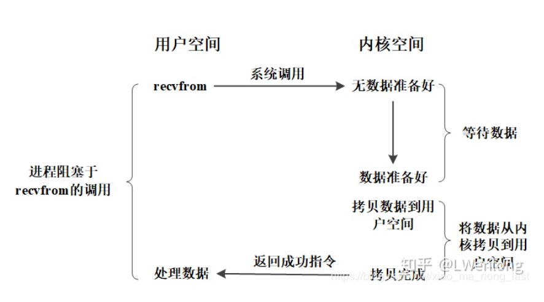
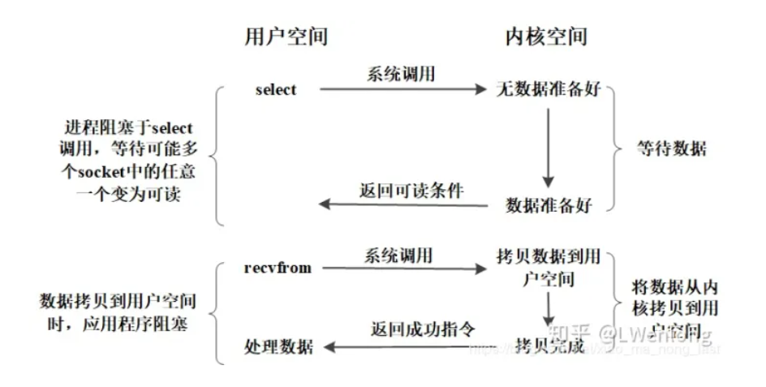
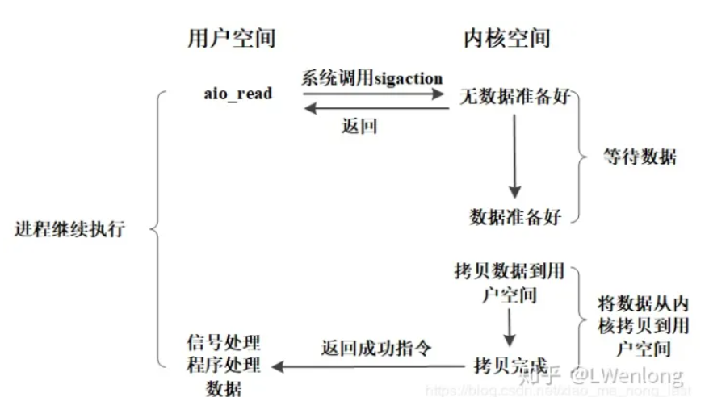
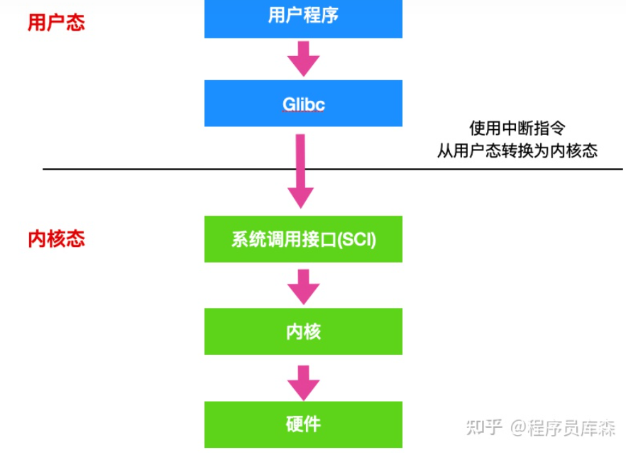
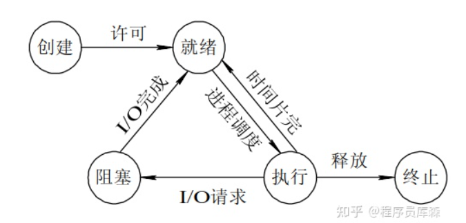

# unix IO模型

BIO: 用户使用recvfrom系统调用后 kernel buffer还没有准备好时用户进程阻塞, kernel buffer准备好时将kernel buffer数据拷贝到user buffer后系统调用才返回



NIO: recvfrom时kernel buffer如果没准备好立刻返回, 不阻塞进程, 但需要进程循环调用recvfrom


多路复用IO(IO multiplexing): 进程先通过poll/epoll/select查询多个kernel buffer是否准备好, 如果有一个准备好就不会阻塞, 然后调用recvfrom拷贝数据到用户buffer

***多路复用io避免了创建多个线程的开销, 适合要服务多个协议/多连接的服务器(如TCP服务器)***



异步IO: 进程调用aio_read后立刻返回, 进程不阻塞, 当kernel buffer拷贝到user buffer完成时, 操作系统会发送给进程一个signal



select poll epoll

```
select和poll使用线性轮询每个io流是否准备好, 但poll没有数量限制
epoll使用异步事件信号得知是否有io流准备好
```

# 用户态和内核态

只有内核态才可以执行一些特权指令, 这样设计的目的是**防止用户程序访问系统资源, 保证系统安全**

唯一切换方式: 中断, 包括用户调用函数库引起的trap和io设备引起的中断



# 中断

中断处理过程

```
0. 关中断
1. 保存进程的相关数据到栈中
2. 开中断
3. 执行中断处理程序
4. 关中断
5. 从栈中恢复进程的数据
6. 开中断
```

# 进程和进程调度

进程5态



进程调度算法: FIFS SFS HRRN RR PRIORITY 多级反馈队列

# 死锁

死锁的条件

```
1. 资源互斥
2. 进程不会被剥夺执行权
3. 进程在持有资源的情况下还在等待其他资源
4. 资源等待链形成环
```

死锁预防, 避免, 检测, 解除

```
预防: 破坏死锁形成的四个条件
避免: 银行家算法找到安全序列
检测: 检测资源依赖图是否形成环
解除: 终止进程/无视死锁
```

# 线程和协程

分为用户级线程和内核级线程, 内核级线程由操作系统kernel管理, 用户级线程由用户进程调用库管理, 对操作系统不可见

两者对应关系为: 1-1 多-1 多-多模型

协程是线程的线程, 一个线程同时只能有一个协程执行, 当执行的协程IO阻塞时, 切换到其他协程, 协程适合IO阻塞密集的任务


# TopK问题
